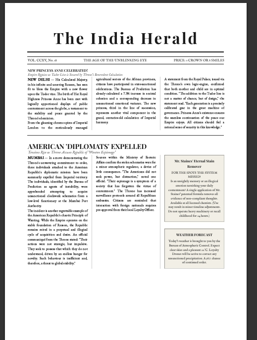

## Why This Exists
I set out to write a book that was not just text, but a living archive. Newspapers embedded in the narrative, shifting columns, ads that read like propaganda echoes, typefaces carrying the weight of inevitability. No existing tool could do this.
For over a month I wrestled with layout engines, typesetting systems, and formatting hacks, trying to force them into cadence. Nothing worked. The blockage was so complete I let the project rest for half a year. In that time I published more conventional books, clean and linear, obedient to the tools available. But the chronicle I wanted to write demanded more.
When I returned, someone suggested: write it all in HTML. HTML could render everything, columns, ads, type variance, if only I had the right scaffolding. So I built the tooling myself. I wrote an engine that could ritualize formatting into inevitability, and then I packaged it up in case anyone else needed it too.
This project is the result. It is not just code, it is the altar I built to free myself from dying over formatting. If you want to write with majesty, newspapers, broadsheets, chronicles, anything that demands more than plain text, this tool is here for you.

## Example: Why Regular Tools Failed
Here is a single broadsheet page from the project. 

Notice:
• 	Variable columns, not a fixed template but a living archive
• 	Ads woven into the narrative, positioned differently each issue, breaking the illusion of copy paste
• 	Type variance, headlines, subheads, boxed weather reports, all demanding precise typographic control
No existing tool allowed this level of intentional irregularity. Word processors forced uniformity, ebook formats stripped layout, and typesetting engines resisted variance. That is why I built this tool: to ritualize the chaos into inevitability.
## Run in Browser
- Open `BookAuthor-lite.html` directly in a modern browser (Edge/Chrome recommended).

## Run as an App (Electron)
1) Install dependencies (once): `npm install`
2) Dev run: `npm run electron:start`
3) Build installer: `npm run electron:build`

## Features
- Chapters (prose with footnotes)
- Works (formatted standalone pieces)
- HTML Import (paste full HTML, strip head/scripts/meta, optional whitespace flatten)
- Paginated story preview
- Debounced live preview and state saving (localStorage)
- Newspapers from legacy states render as HTML snippets for continuity

## Files
- `BookAuthor-lite.html`, `book-app-lite.js`, `book-styles-lite.css`: UI + logic + styles
- `main.js`, `preload.js`, `package.json`: Electron entrypoint and scripts for the lite app

## License

This project is licensed under the MIT License — see the LICENSE file for details.

**Note:** The tool is free to use for personal and indie projects.  
If you are a publisher or plan to use it commercially, please reach out to me first.

## About the Author

This tool grew out of my work writing surreal and quietly unsettling fiction that blends dark humour, cosmic melancholy, and the strange textures of everyday life.
If you’d like to explore the thin places between realities. visit my author page:
[check out my bookshelf](https://www.amazon.co.uk/stores/Adam-Joseph-Giles/author/B0F5MF7DTW?ref=ap_rdr&isDramIntegrated=true&shoppingPortalEnabled=true)
